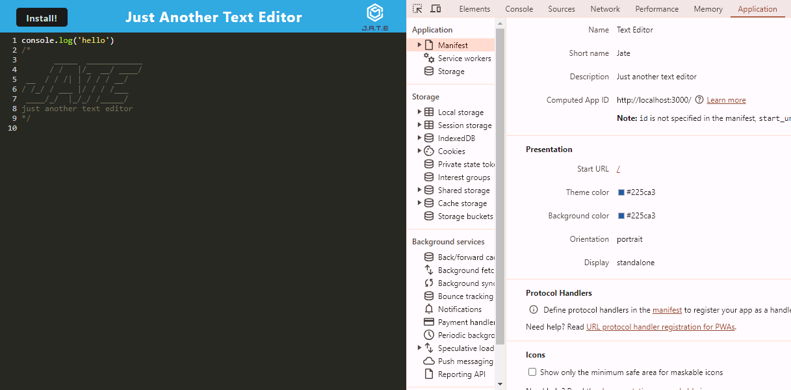
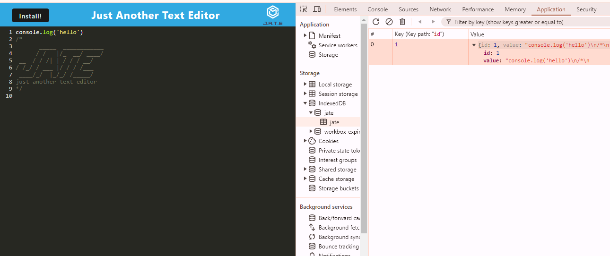

# Text Editor PWA Challenge    

# [CLICK TO VIEW DEPLOYED APPLICATION](https://pwa-text-editor-challenge-g6a3.onrender.com)

## Table of Contents
- [Description](#description)
- [Installation](#installation)
- [Usage](#usage)
- [Contributors](#contributing)
- [Tests](#tests)
- [License](#license)
- [Questions](#questions)

## Description
 This project showcases a text editor that runs in the browser. This app is a single-page application that meets the PWA criteria. Additionally, it features a number of data persistence techniques that serve as redundancy in case one of the options is not supported by the browser. The application also functions offline.

## Installation
To install the application, navigate to website: https://pwa-text-editor-challenge-g6a3.onrender.com and click on the `install` button on top left of the page.

## Usage
To use the application, simply type any character on the text editor screen. Typed characters should persist even when the page is reloaded. 

## Contributing
Contributions are welcome!!!

## Questions
  My GitHub profile is: Jenina52112 [View on GitHub](https://github.com/Jenina52112)

  For additional questions, contact me at email address: jen@gmail.com
